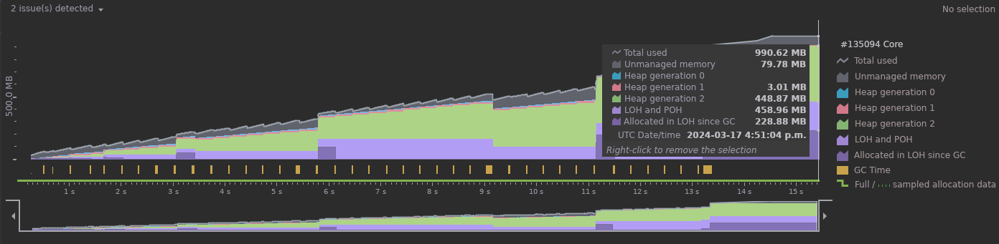

# Modern vs. Traditional Performance

## Objectives

- Convert two lists into a dictionary and compare different approaches
- Validate assumptions about dotnet performance using different approaches
- Implement a couple versions of the code: traditional, modern, and functional
- Compare performance of the approaches: run-time and memory allocation
- Use the same IDE, input, and the same host for profiling purposes

## Method Used

- Implement three versions of the code:
  - [Traditional](Core/TraditionalDictionary.cs) 
  - [Modern](Core/ModernDictionary.cs)
  - [Functional](Core/FunctionalDictionary.cs)
- Run a profile to compare timeline and memory allocation
- JetBrain Rider Profiler on Ubuntu 22.04 was used for testing purposes
  - 16 Cores 11th Gen Intel(R) Core(TM) i7-11850H @ 2.50GHz
  - 32GB RAM

## Findings

- Timeline profiler results

- Traditional memory allocation profiler results
  

- Modern memory allocation profiler results
  

- Functional memory allocation profiler results
  
- 
## Conclusions

- To my surprise it is not in favour of modern nor functional implementation
- The traditional was about 5 times faster than the modern or functional
- The traditional consumed less than half the memory of the modern or functional
- Have I missed something optimizing the modern or the functional approach?